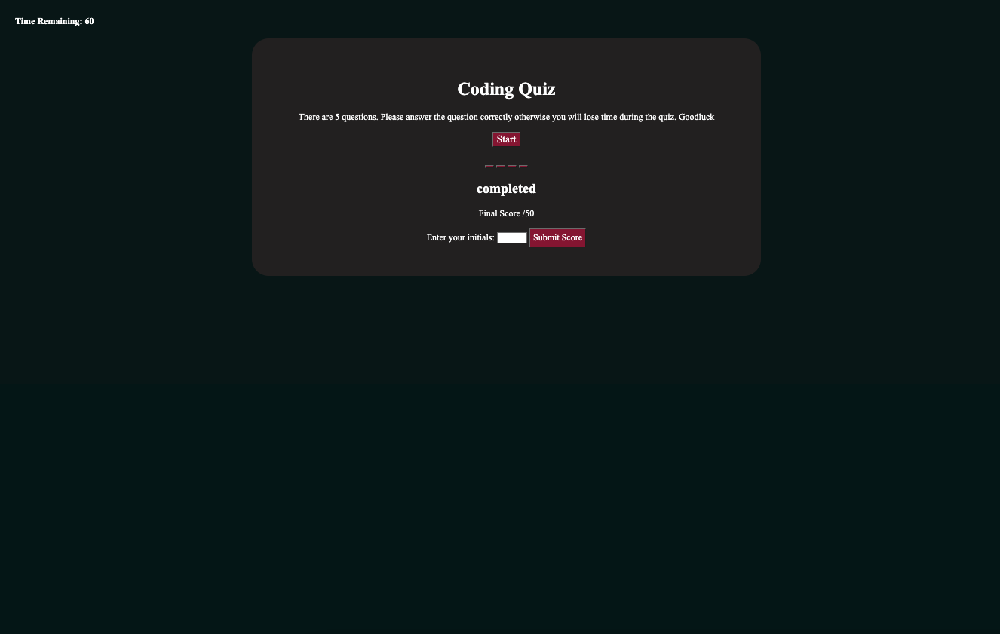

# Quiz

## Techonlogies Used
During this project. I used the following techonlogies 
- Index.html 
- CSS 
- README.md 
- script.js
- Gitlab 
- Github

## Description
 This project is made to give out a quiz to the users. This quiz is timed to 120second and every time you answer the question wrong, 10seconds will be deducted from the total of time you have left. If you answer the question correctly, the time will be the same. If you answer the question correctly, the yellow box will be appear on the answer you have choosen, if the box doesnt turn yellow, the answer you have choose is incorrect. At the end you able to see you final score out of 50 and write your initials to keep the highestscore record. 

## Credits
N/A

## Deployed link
https://github.com/rlee7029/Quiz